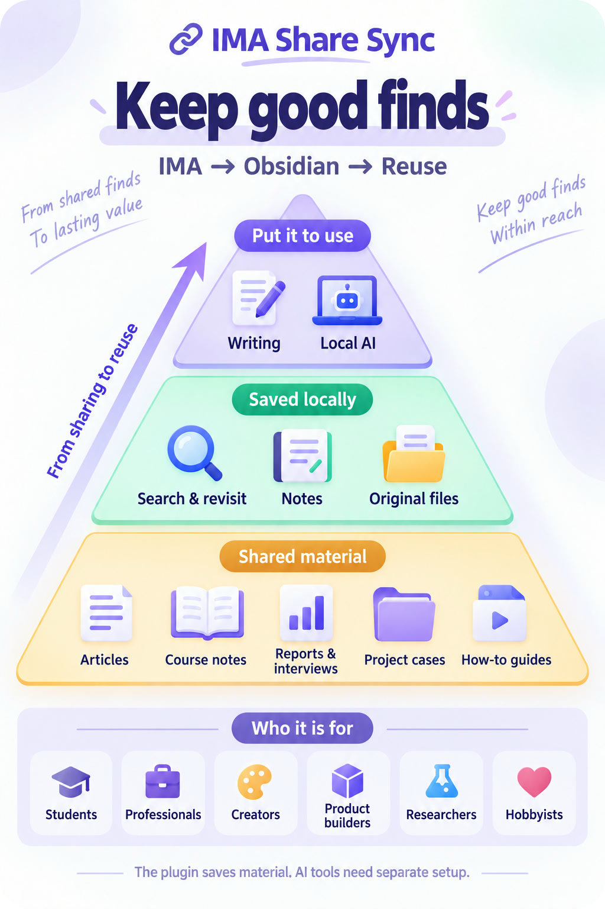

<h1>IMA Share Sync</h1>

<a href="README.md">简体中文</a> · <strong>English</strong>

<strong>Good finds are worth keeping.</strong>

Save articles, tutorials, and files others share through IMA into Obsidian. Revisit them, use them as writing references, or give them to your own local AI tool.

<a href="https://github.com/oooing/ima-share-sync/blob/main/docs/GUIDE.md">Setup guide</a> · <a href="https://github.com/oooing/ima-share-sync/releases/tag/0.2.0">Download files</a>

Windows 10+ · Obsidian 1.11.4+ · Installed and signed-in IMA desktop.

<a href="#who-it-is-for">Use cases</a> · <a href="#available-features">All features</a>

---

## Who it is for

[Study and learn](#study-and-learn) · [Keep work references](#keep-work-references) · [Prepare to write](#prepare-to-write) · [Research products](#research-products) · [Follow an industry](#follow-an-industry) · [Collect hobby tips](#collect-hobby-tips)

See the overview

### Study and learn

**For**: Students, exam candidates, and anyone learning a skill.

**For example**: Keep shared course handouts and learning articles together. Revisit them while studying, or ask your own local AI to outline the key ideas.

 

### Keep work references

**For**: New hires, project leads, and people who write proposals.

**For example**: Save project examples and work guides shared by colleagues. Find the references again when preparing your next proposal or presentation.

 

### Prepare to write

**For**: Writers, editors, and people who share what they learn.

**For example**: Keep articles, personal stories, and industry examples. Check sources as you write, or ask your own local AI to organize material into an outline.

 

### Research products

**For**: Product managers, designers, and independent developers.

**For example**: Save product overviews, user feedback, and design examples. Compare features, prices, and approaches when planning your next update.

 

### Follow an industry

**For**: Industry researchers, investment analysts, and long-term observers.

**For example**: Keep shared reports, company analyses, and industry interviews. Ask your own local AI to compare viewpoints, then check the original evidence.

 

### Collect hobby tips

**For**: People who enjoy photography, gardening, cooking, and other hobbies.

**For example**: Keep composition tutorials, gardening advice, or recipes. Revisit them while practicing, and add your own observations in Obsidian.

*The plugin saves material. AI organization and analysis need tools you configure separately.*

---

## Available features

### Save material

 <strong>Save articles</strong> 
Save IMA articles you are allowed to keep as Obsidian notes to search, annotate, and read alongside existing notes.

 <strong>Keep originals</strong> 
Save PDFs, images, and supported audio or video files through IMA's available download routes.

 <strong>Choose material</strong> 
Check 1–30 recent items or widen the scope. Filter by title; bulk saving still has item limits.

 <strong>Keep folders</strong> 
Include subfolders, set search depth and folder counts, and organize saved files using source folder names.

### Organize notes

 <strong>Make notes</strong> 
Extract existing PDF text into notes, with optional links to originals. Image-only scans get placeholder notes.

 <strong>Fill missing notes</strong> 
Create missing notes from saved PDFs without downloading the originals again.

 <strong>Skip saved articles</strong> 
Recognized saved articles are skipped by default to reduce duplicate saving.

 <strong>Protect notes</strong> 
Same-name files are not overwritten by default. PDF conversion protects notes created outside this plugin.

 <strong>Check PDFs</strong> 
Check PDFs before import and show a reason when a file is damaged or protected.

### Stay in control

 <strong>Control saving</strong> 
Start manually or enable startup saving. Defer or cancel before automatic saving begins, and stop a running save.

 <strong>Review results</strong> 
See the articles and results from each save. Locate the corresponding record when something fails.

 <strong>See progress</strong> 
View progress and choose result notifications, badges, and desktop reminders.

 <strong>Choose a language</strong> 
Settings can follow Obsidian or use Chinese or English. Some sidebar and runtime messages remain in Chinese.

