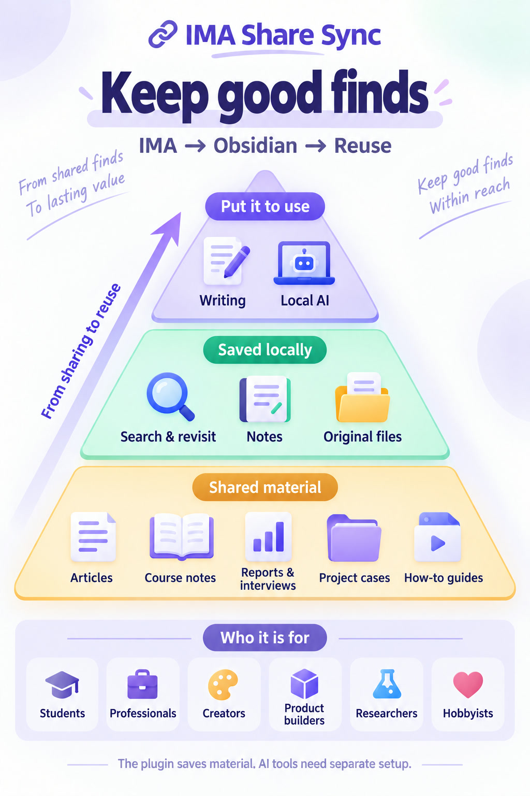

# IMA Share Sync

[简体中文](README.md) · **English**

**Good finds are worth keeping.**

Save articles, tutorials, and files others share through IMA into Obsidian. Revisit them, use them as writing references, or give them to your own local AI tool.

  

<a href="https://github.com/oooing/ima-share-sync/blob/main/docs/GUIDE.md">Setup guide</a> · <a href="https://github.com/oooing/ima-share-sync/releases/tag/0.2.0">Download files</a>

Windows 10+ · Obsidian 1.11.4+ · Installed and signed-in IMA desktop.

## Who it is for

  

<table>
  <tr>
    <td width="50%" valign="top">
      <h3>Study and learn</h3>
      
<strong>For</strong>: Students, exam candidates, and anyone learning a skill.

      
<strong>For example</strong>: Keep shared course handouts and learning articles together. Revisit them while studying, or ask your own local AI to outline the key ideas.

    </td>
    <td width="50%" valign="top">
      <h3>Keep work references</h3>
      
<strong>For</strong>: New hires, project leads, and people who write proposals.

      
<strong>For example</strong>: Save project examples and work guides shared by colleagues. Find the references again when preparing your next proposal or presentation.

    </td>
  </tr>
  <tr>
    <td width="50%" valign="top">
      <h3>Prepare to write</h3>
      
<strong>For</strong>: Writers, editors, and people who share what they learn.

      
<strong>For example</strong>: Keep articles, personal stories, and industry examples. Check sources as you write, or ask your own local AI to organize material into an outline.

    </td>
    <td width="50%" valign="top">
      <h3>Research products</h3>
      
<strong>For</strong>: Product managers, designers, and independent developers.

      
<strong>For example</strong>: Save product overviews, user feedback, and design examples. Compare features, prices, and approaches when planning your next update.

    </td>
  </tr>
  <tr>
    <td width="50%" valign="top">
      <h3>Follow an industry</h3>
      
<strong>For</strong>: Industry researchers, investment analysts, and long-term observers.

      
<strong>For example</strong>: Keep shared reports, company analyses, and industry interviews. Ask your own local AI to compare viewpoints, then check the original evidence.

    </td>
    <td width="50%" valign="top">
      <h3>Collect hobby tips</h3>
      
<strong>For</strong>: People who enjoy photography, gardening, cooking, and other hobbies.

      
<strong>For example</strong>: Keep composition tutorials, gardening advice, or recipes. Revisit them while practicing, and add your own observations in Obsidian.

    </td>
  </tr>
</table>

*The plugin saves material. AI organization and analysis need tools you configure separately.*

## Available features

<table>
  <thead><tr><th width="205">Feature</th><th>What it does</th></tr></thead>
  <tbody>
    <tr><td> <strong>Save articles</strong></td><td>Save IMA articles you are allowed to keep as Obsidian notes to search, annotate, and read alongside existing notes.</td></tr>
    <tr><td> <strong>Keep originals</strong></td><td>Save PDFs, images, and supported audio or video files through IMA's available download routes.</td></tr>
    <tr><td> <strong>Choose material</strong></td><td>Check 1–30 recent items or widen the scope. Filter by title; bulk saving still has item limits.</td></tr>
    <tr><td> <strong>Keep folders</strong></td><td>Include subfolders, set search depth and folder counts, and organize saved files using source folder names.</td></tr>
    <tr><td> <strong>Make notes</strong></td><td>Extract existing PDF text into notes, with optional links to originals. Image-only scans get placeholder notes.</td></tr>
    <tr><td> <strong>Fill missing notes</strong></td><td>Create missing notes from saved PDFs without downloading the originals again.</td></tr>
    <tr><td> <strong>Skip saved articles</strong></td><td>Recognized saved articles are skipped by default to reduce duplicate saving.</td></tr>
    <tr><td> <strong>Protect notes</strong></td><td>Same-name files are not overwritten by default. PDF conversion protects notes created outside this plugin.</td></tr>
    <tr><td> <strong>Check PDFs</strong></td><td>Check PDFs before import and show a reason when a file is damaged or protected.</td></tr>
    <tr><td> <strong>Control saving</strong></td><td>Start manually or enable startup saving. Defer or cancel before automatic saving begins, and stop a running save.</td></tr>
    <tr><td> <strong>Review results</strong></td><td>See the articles and results from each save. Locate the corresponding record when something fails.</td></tr>
    <tr><td> <strong>See progress</strong></td><td>View progress and choose result notifications, badges, and desktop reminders.</td></tr>
    <tr><td> <strong>Choose a language</strong></td><td>Settings can follow Obsidian or use Chinese or English. Some sidebar and runtime messages remain in Chinese.</td></tr>
  </tbody>
</table>
