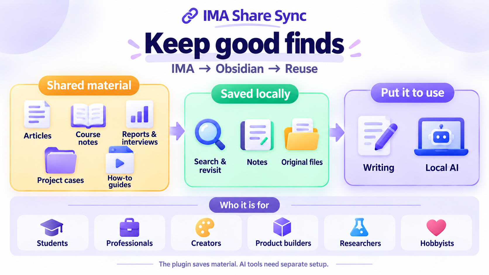
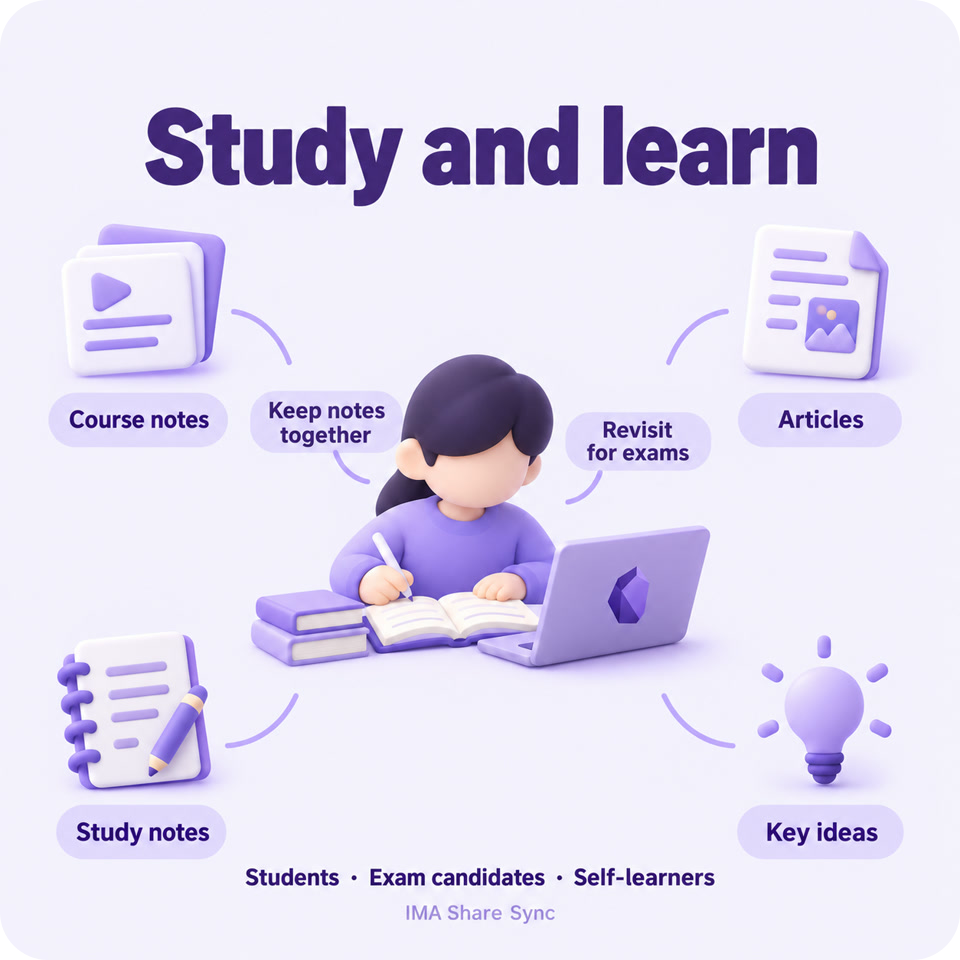
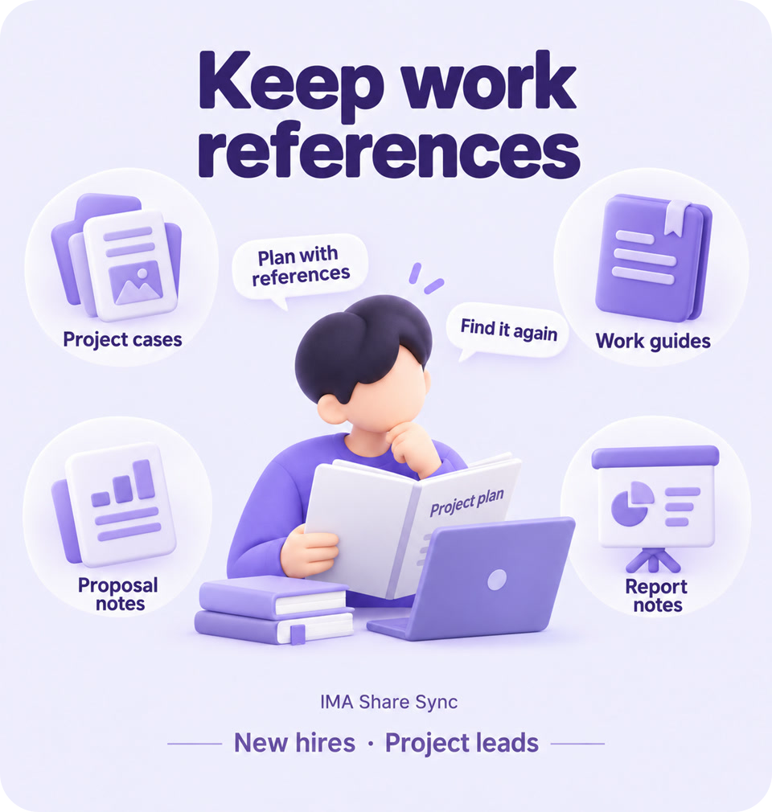
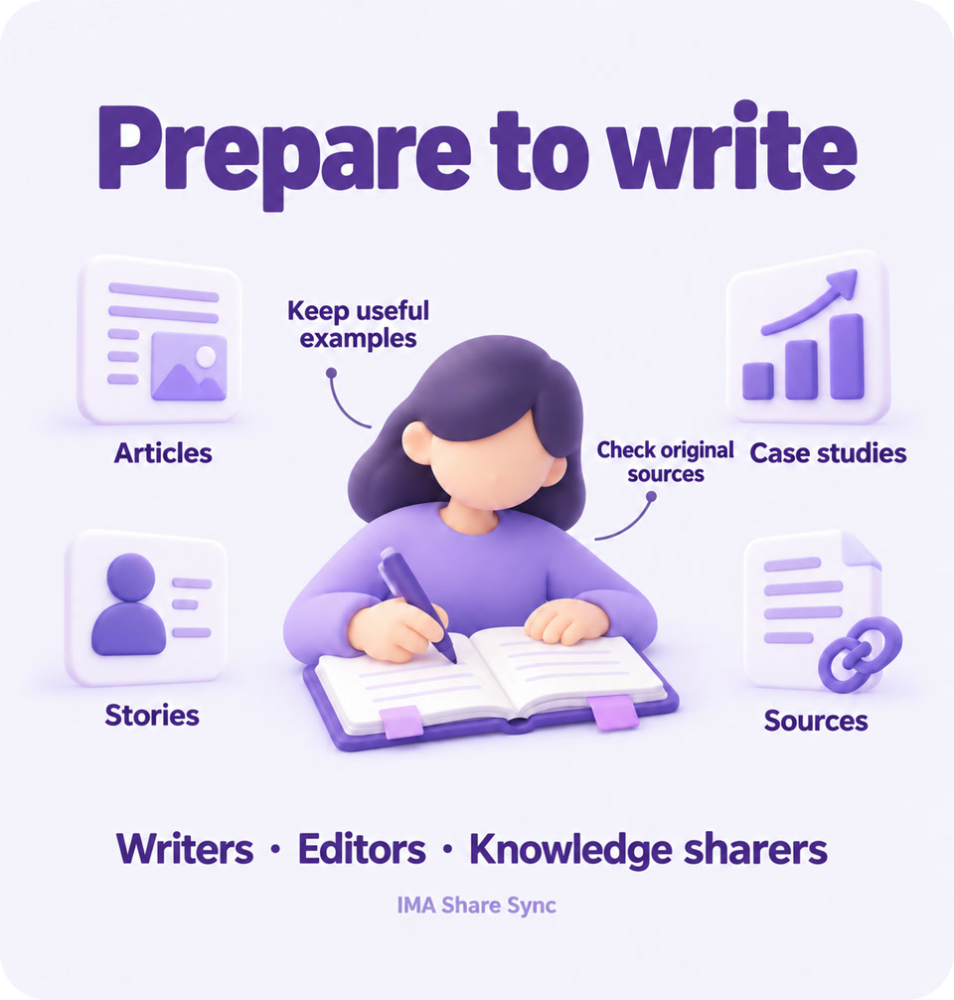
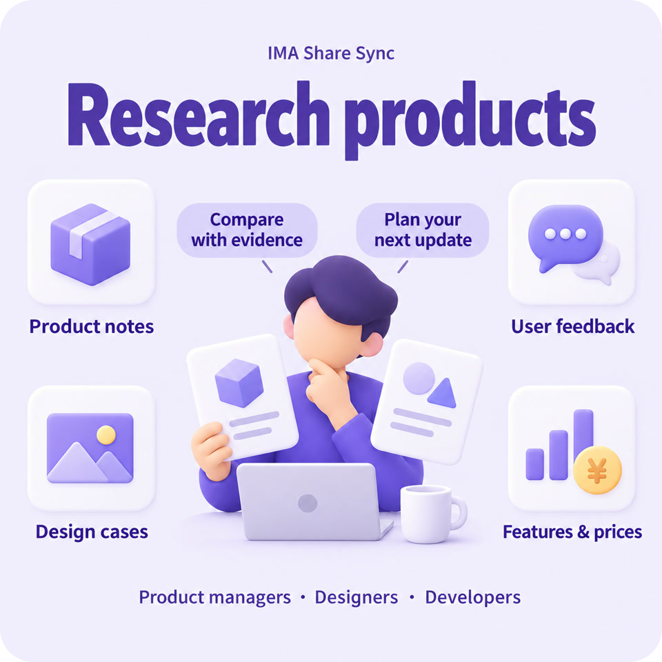
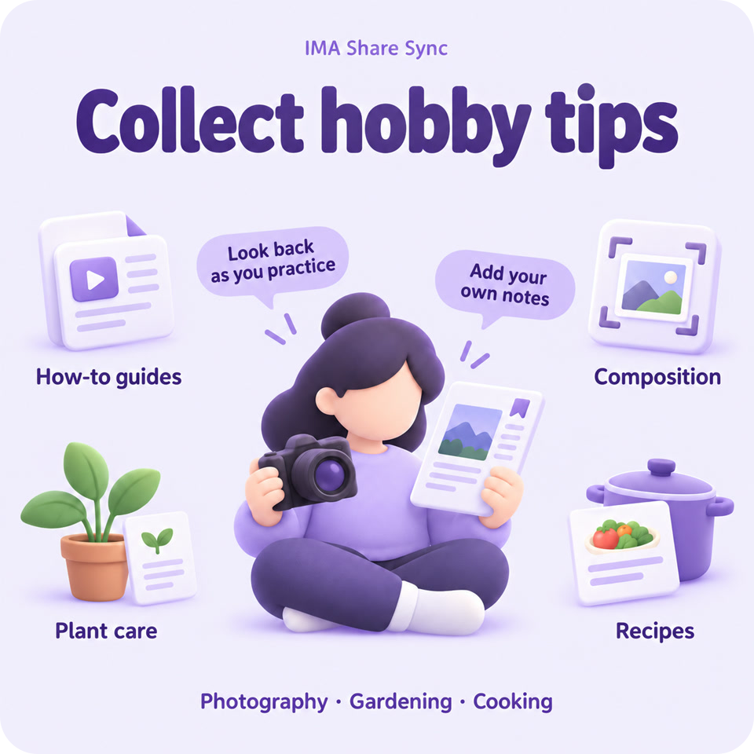

<h1>IMA Share Sync</h1>

<a href="README.md">简体中文</a> · <strong>English</strong>

<strong>Keep it handy</strong>

Save articles and files shared through IMA as notes and files in Obsidian. Find them when you need them. Use them when you write.

<a href="https://obsidian.md/plugins?id=ima-speed-sync"><strong>Community listing →</strong></a>

<a href="https://github.com/oooing/ima-share-sync/blob/main/docs/GUIDE.md">Manual setup</a> · <a href="https://github.com/oooing/ima-share-sync/releases/tag/0.2.0">Download files</a>

Windows 10+ · Obsidian 1.11.4+ · Installed and signed-in IMA desktop

Version 0.2.0 is released. Community installation is not yet available; follow the guide to install manually.

<a href="#who-it-helps">Who it helps</a> · <a href="#what-it-does">What it does</a>

---

## Who it helps

Keep useful material on your computer for learning, work, and writing.

> The plugin saves material. AI tools for organizing or analyzing it need separate setup.

---

### Industry research

**For**: People studying industries, companies, and changes over time.

**For example**: Save reports, company analyses, and interviews. Compare viewpoints and check the original source.

---

### Study and learn

**For**: Students, exam candidates, and anyone learning a new skill.

**For example**: Keep handouts and learning articles together, with fewer places to search when you study.

---

### Work references

**For**: New hires, project leads, and anyone writing proposals.

**For example**: Save examples and guides from colleagues. Find them again for your next proposal or presentation.

---

### Writing material

**For**: Writers, editors, and people who share what they know.

**For example**: Keep articles and personal stories for your next piece. Find the source when you need to cite it.

---

### Product research

**For**: People who build products, design, or develop software.

**For example**: Keep product details, user feedback, and design examples together to compare features and prices.

---

### Hobby tips

**For**: People who enjoy photography, gardening, or cooking.

**For example**: Keep tutorials, plant care tips, and recipes handy as you practice. Add what you learn along the way.

---

## What it does

Open a group to see what you can do.

<strong>Save material</strong> · 4 features

**Save articles**  
Save IMA articles you are allowed to keep as Obsidian notes. Search, annotate, and read them alongside your other notes.

**Keep originals**  
Keep PDFs, images, and supported audio or video originals using the downloads available in IMA.

**Choose material**  
Start with 1–30 recent items, widen the search, or filter by title. Each batch has a saving limit.

**Keep folders**  
Keep the original folder names. Include subfolders and limit how many folders and levels to search.

<strong>Organize notes</strong> · 5 features

**Make notes**  
Turn existing PDF text into notes, with optional links to the original. Scans get a notice; text inside images is not read.

**Fill missing notes**  
Add missing notes for PDFs you have already saved, without downloading the files again.

**Skip saved articles**  
Articles recognized as already saved are skipped by default, reducing duplicate copies.

**Protect notes**  
Files with the same name are not replaced by default. Turning PDFs into notes also preserves notes made outside this plugin.

**Check files**  
Check whether a PDF can be read. If it is damaged or access is restricted, see the reason.

<strong>Everyday controls</strong> · 4 features

**Control saving**  
Start manually or save when Obsidian opens. Delay or cancel an automatic start, or stop a save already in progress.

**Review results**  
See which articles were saved and whether each save worked. Find the matching record if something goes wrong.

**See progress**  
Follow saving progress. Choose result reminders, notices on icons, or desktop notifications.

**Choose language**  
Use Chinese or English for settings, or follow Obsidian's language. Some sidebar text and messages are still in Chinese.

---

### Start collecting

Keep your next good find on your own computer.

**[Community listing →](https://obsidian.md/plugins?id=ima-speed-sync)** · [Manual setup](https://github.com/oooing/ima-share-sync/blob/main/docs/GUIDE.md)
