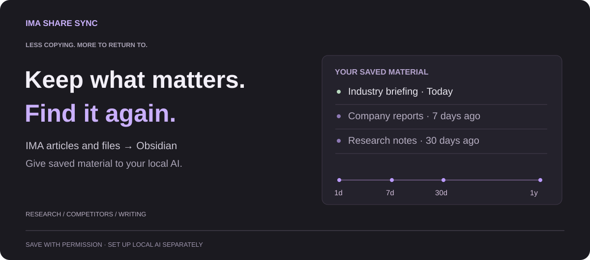

# IMA Share Sync

[简体中文](README.md) · **English**

## Keep what matters

Save valuable reports and articles others share through IMA into Obsidian. Then give them to a local AI tool you configure for analysis.

  

<a href="https://github.com/oooing/ima-share-sync/blob/main/docs/GUIDE.md">Setup guide</a> · <a href="https://github.com/oooing/ima-share-sync/releases/tag/0.2.0">Download files</a>

Windows 10+ · Obsidian 1.11.4+ · Installed and signed-in IMA desktop.

## Put saved material to use

- **Less copying.** Choose an IMA source and an Obsidian destination. Let the plugin save articles for you.
- **Find it again.** Search and annotate saved notes alongside the notes you already have in Obsidian.
- **Bring your own AI.** Give saved material to a local AI tool you configure to compare views, spot changes, and check sources.

## New in 0.2.0

- **Keep originals.** Save PDFs, images, and supported audio or video files through IMA's available download routes.
- **Make notes.** Turn text in PDFs into searchable notes. No separate conversion tool is needed.
- **Choose what to save.** Pick recent material, or filter by title and folder.
- **Keep folders.** Include subfolders and use source folder names to keep saved material organized.
- **Fill missing notes.** Create missing notes from saved PDFs and optionally link back to the originals.
- **Check PDFs.** Get a reason when damaged or protected PDFs cannot be imported.
- **Find settings.** Saving, note conversion, reminders, and general options have separate tabs. Choose Chinese or English.
- **Keep your limits.** Existing item-count rules stay in place until you choose to change them.

[Release notes](https://github.com/oooing/ima-share-sync/releases/tag/0.2.0) · [Selection rules](docs/general-selection.md)

## Ways to use it

- **Follow research.** Give reports from different dates to a local AI tool you configure, then compare changes in views and evidence.
- **Watch competitors.** Keep articles about product and pricing changes so you can compare them later.
- **Prepare to write.** Save articles and examples, find ideas when writing, and return to the original material.
- **Keep researching.** Build a collection around a question and revisit earlier notes when new material arrives.

[More ideas](docs/USE-CASES.md)

## Start saving

1. Install from the button above and follow the setup guide.
2. Choose the shared IMA source and the Obsidian folder where material should go.
3. Start saving. To analyze it with AI, separately configure a local tool that can read those files.

## Before you start

- **Scanned PDFs.** Image-only PDFs get a note linking to the original. Text inside images is not recognized.
- **Complex layouts.** Tables and layouts may differ from the original. Check the source when quoting.
- **Saving limits.** Bulk saving still has folder and item limits; it does not promise to save everything in one run.
- **Permission.** Save only material you are allowed to copy or download. Original files need an available IMA download route.
- **Your own AI.** AI tools need separate setup. The plugin itself does not generate analysis.
- **Languages.** Settings support Chinese and English. Some sidebar and runtime messages remain in Chinese.
- **Saved items.** Recognized saved articles are skipped by default. Results are recorded.
- **Stop when needed.** Saving may open IMA. You can stop the process.
- **Copyright.** Saving a local copy does not permit redistribution. The plugin does not unlock paid content or bypass restrictions.

## Privacy

No usage-data collection or custom upload servers. IMA needs internet; the AI tools or note-sync services you configure may upload content you authorize.

Licensed under [MIT](LICENSE). Independent project, not affiliated with Tencent, IMA, or Obsidian.

[Full guide](docs/GUIDE.md) · [Technical details](docs/TECHNICAL.md) · [Privacy details](SECURITY.md) · [Feedback](https://github.com/oooing/ima-share-sync/issues)
