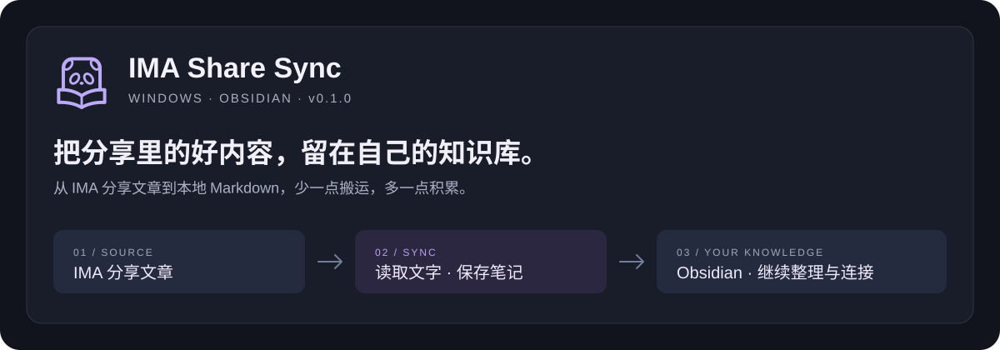

<p align="center">
  
</p>

<p align="center">
  <strong>少一点复制粘贴，多一点阅读和整理。</strong><br>
  Windows 专用 · Obsidian 插件 · 本地 Markdown · MIT 开源
</p>

<p align="center">
  <a href="https://github.com/oooing/ima-share-sync/releases/tag/0.1.1">下载 0.1.1</a> ·
  <a href="#快速开始">快速开始</a> ·
  <a href="#使用前请了解">使用边界</a> ·
  <a href="https://github.com/oooing/ima-share-sync/issues">反馈问题</a>
</p>

---

## 你可能也有这样的日常

你订阅了一个 IMA 共享知识库，每天都有新的行业简报、学习资料或工作笔记。

阅读在 IMA，自己的总结却放在 Obsidian。想把值得留下的文章整理到一起，就要反复做这些事：

**打开文章 → 复制正文 → 新建笔记 → 整理格式 → 确认有没有存过。**

几天以后，你开始记不清：哪篇已经保存？哪篇漏了？失败的那篇到底有没有进笔记库？

**IMA Share Sync 把这段重复流程接起来。** 它通过本机 IMA 桌面端读取你有权访问的分享文字文章，保存到指定的 Obsidian 文件夹。内容留下后，你可以继续搜索、标注、建立双向链接，把资料变成自己的知识。

> **一个具体场景：每天整理行业简报**
>
> 你把 IMA 中的「每日简报」同步到 Obsidian 的「资料/行业观察」。
>
> 设置每次检查最近 **7 篇**。假设其中 5 篇已被识别为已保存、2 篇是新文章，在“同名不覆盖”模式下，已有内容跳过，新文章写入 Markdown。
>
> 第二天继续同步，再到自己的笔记里写结论、链接相关项目，不用逐篇搬运。哪篇没成功，打开同步日志就能找到原因。
>
> *7 是检查范围，不是必须新增 7 篇；它不会为了凑数继续抓取更早的文章。*

## 它帮你省下什么

| 你关心的事 | 插件怎么处理 |
| --- | --- |
| 把分享文章留下来 | 保存为仓库内的 Markdown 文件，方便后续整理 |
| 不想每次重复复制 | 默认不覆盖同名文件；能识别的已保存来源优先跳过 |
| 怕覆盖自己的笔记 | 通用模式下，来源不确定的同名文章按冲突处理，不擅自覆盖 |
| 想找回漏掉的文章 | 本地文件删除后，若仍在本次检查范围内，可重新尝试同步 |
| 不想电脑突然自己动 | 自动同步前有 5 秒提示；可推迟、取消，运行中可停止 |
| 想知道每次发生了什么 | 侧栏内查看完整同步历史，每页 20 条，错误可直接定位 |
| 不想安装一串依赖插件 | 独立运行，不需要其他 Obsidian 插件 |

## 快速开始

### 1 · 准备好这三样

- **Windows 10 或更新版本**，保持可交互的桌面会话。
- **Obsidian 桌面版 1.11.4 或更新版本**。
- 已安装并登录的 **IMA 桌面端**，且你能打开要同步的知识库和文件夹。

目前不支持 macOS、Linux、Android 或 iOS。

### 2 · 安装插件

从 [0.1.1 发布页](https://github.com/oooing/ima-share-sync/releases/tag/0.1.1) 下载这三个文件：

```text
你的 Obsidian 仓库/
└─ .obsidian/
   └─ plugins/
      └─ ima-speed-sync/
         ├─ main.js
         ├─ manifest.json
         └─ styles.css
```

把文件放好后，打开 **设置 → 第三方插件**，启用 **IMA Share Sync**。若列表没有刷新，重启 Obsidian。

> 文件夹名 `ima-speed-sync` 是为兼容已有安装保留的内部 ID；显示名称是 **IMA Share Sync**。已有用户更新时只替换上述三个文件，**不要覆盖或删除 `data.json`**，以保留配置和历史日志。

### 3 · 告诉它“从哪来，存哪去”

在插件设置中填写：

| 配置 | 示例 |
| --- | --- |
| IMA 知识库名称 | 我的学习资料 |
| IMA 文件夹名称 | 每日简报 |
| Obsidian 保存文件夹 | 资料/行业观察 |
| 内容模式 | 通用文字 |
| 检查最近文章数 | 7 |

名称填写 IMA 界面中显示的完整名称；保存位置是**当前仓库内的相对路径**。

### 4 · 点一次「立即同步」

首次使用需要确认本地自动化授权。之后手动点击会直接开始，**不再额外倒计时**。

同步完成后，到目标文件夹阅读新笔记。也可以在插件侧栏点击 **同步日志**，展开每次运行结果；再次点击入口或「收起」即可折叠，不会删除记录。

插件标题旁和设置页会显示当前安装的版本号，方便确认更新是否生效。

## 日常使用，尽量少打扰

**你主动点击时**

立即开始；右下角显示简短进度和停止按钮。结束后只显示关键结果。

**你开启启动时同步后**

自动运行前默认预留 5 秒，可立即开始、5 分钟后或取消。启动时同步默认关闭，需要你自行开启并完成授权。

**出现异常时**

提示里只显示概要，点「查看原因」看简短说明；完整错误保留在插件日志。未读异常标记查看后消除，下次新异常再提醒。

<p align="center">
  
  <br><sub>原生提示框的测试数据示例；并非每次同步都会报错。</sub>
</p>

提醒、异常标记、开始与结束提示都有配置项。关闭提醒不影响记录；运行中的停止入口仍然保留。**界面刻意简短，历史可以随时回看。**

## 使用前请了解

### 支持文字文章，不等于导出整个 IMA

新安装默认使用「通用文字」模式，不要求标题是日期，也不要求有目录、更新时间或最低字数。

- 识别到的标题、正文、链接和分隔线会尽量还原为 Markdown。
- 链接目标不可访问、正文边界无法确认时，会明确报错，不把不完整结果冒充成功。
- **PDF、图片、附件、内嵌卡片和复杂表格**不属于当前版本的完整导出范围。
- 目前针对已验证的中文分享文件夹界面；IMA 布局更新可能影响读取。

<details>
<summary>以前用的是“速看”模式，会不会升级后乱抓内容？</summary>

不会自动扩大原来的范围。已有安装保留「速看预设」，继续使用原有标题及文章结构规则。需要同步其他文字内容时，请在设置中主动切换到「通用文字」。

</details>

<details>
<summary>“不覆盖”也会检查旧文章有没有更新吗？</summary>

不会。不覆盖模式优先跳过已识别的本地来源，不主动检查新版本。通用模式即使开启覆盖，也需确认是同一来源；无法确认时保护原文件。旧速看预设保留原有按文件名处理的行为，详情见技术说明。

</details>

<details>
<summary>同步时还能正常使用电脑吗？</summary>

插件优先使用限定到 IMA 窗口的可访问性操作，不使用全局全选复制，也不占用剪贴板。但 **IMA 可能自行弹出窗口**，这不是完全无界面的后台服务。同步期间请避免操作正在读取的 IMA 文章。

「允许短时前台操作」默认关闭；如需此后备路径，须由你自行开启。运行中始终有停止入口，取消只保留已验证完成的文章。

</details>

<details>
<summary>为什么插件侧栏和 Obsidian 文件列表的顺序不一样？</summary>

插件侧栏优先按可识别的标题日期倒序显示；没有标题日期时，使用可用来源时间或本地创建时间。Obsidian 原生文件列表有自己的排序设置。插件不为标题擅自补年份，也不自动重命名旧笔记。

</details>

## 内容在本地，操作可知情

插件读取当前登录账户有权查看的文字，只在指定仓库目录内创建或更新 Markdown。**不内置遥测、广告或自有上传服务**；IMA 自身仍可能需要联网。

同步历史保存在插件的 `data.json`，技术诊断位于 `%LOCALAPPDATA%\ima-speed-sync\sync.log`。日志可能包含文章标题，分享前请检查；你的仓库备份或同步服务也可能包含这些文件。

**仓库之外的本地访问：** 为运行已随插件打包的 PowerShell 脚本、传递提取结果和显示原生提示框，插件会在 Windows 临时目录下创建 `ima-speed-sync/run-*` 与 `ima-operation-card-*` 工作目录，并在结束时尝试清理。崩溃或清理失败时可能残留临时文件。诊断日志保留在上述 `%LOCALAPPDATA%` 目录，用于排查同步失败；必要时会读取该目录下 IMA 的安装路径以启动客户端。插件不会从网络下载或安装脚本、依赖或更新自身。

**账号与网络：** 需要你自行安装并登录 IMA，由 IMA 客户端访问分享内容；插件不收集 IMA 密码、不调用自建服务器。点击 GitHub 支持或文档链接时才会由浏览器打开相应网站。

请只同步有权复制、保存的内容。本项目是独立社区插件，**非腾讯、IMA 或 Obsidian 官方产品**，不代表上述品牌的授权或背书。

## 开发与贡献

```powershell
npm ci
npm run check
npm run build
```

构建产物在 `dist/`。完整检查覆盖版本一致性、代码规范、类型、JavaScript 行为、PowerShell 提取逻辑和原生提示框；自动化测试不等同于所有 IMA 版本的实机兼容性保证。

- [技术说明与已知限制](docs/TECHNICAL.md)
- [0.1.1 更新说明](docs/releases/0.1.1.md)
- [安全与隐私说明](SECURITY.md)
- [提交问题或建议](https://github.com/oooing/ima-share-sync/issues)

反馈时建议附上 Windows / Obsidian / IMA 版本、文章类型和**脱敏后的**错误信息，不要公开个人资料、正文或访问凭据。

## 开源许可

代码采用 [MIT License](LICENSE)。相关产品名称与品牌标识属于各自权利人。

如果它让你少做了几次复制粘贴，欢迎在 GitHub 点个 **Star**，也欢迎反馈真实使用场景。
