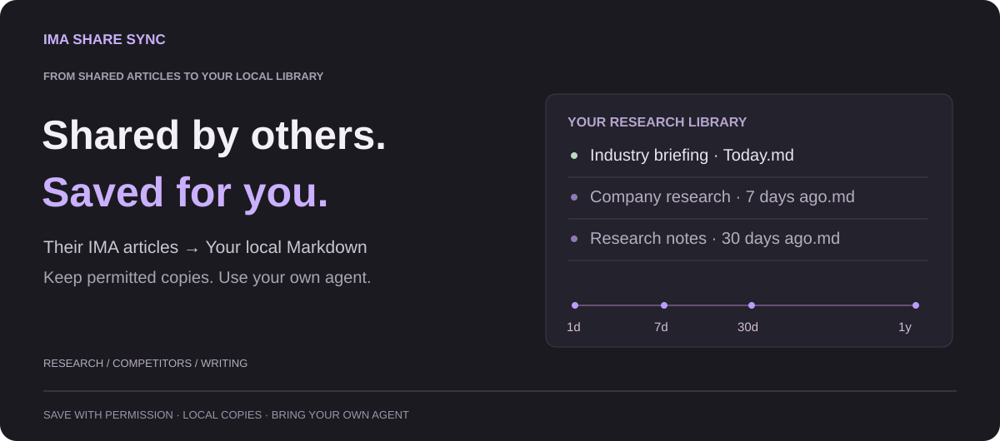

# IMA Share Sync

**English** · [简体中文](https://github.com/oooing/ima-share-sync/blob/main/README.zh-CN.md)

**Shared by others. Saved for your own research.**

Save **text articles others share through IMA** as local Markdown in Obsidian—not just your own uploads. Search and annotate them alongside your notes, then analyze them with your own agent.

## Follow companies and industries over time

Keep a daily local archive of research shared with you, including paid material where saving is permitted. Use your agent to compare 3 / 7 / 30 days, six months, or a year of company and industry views—and find changes worth investigating.

> “What changed in robotics orders and production expectations over the past 7 days? Compare with the preceding 30 days and cite the sources.”

## More ways to use your reading

**Track competitors.** Collect product updates and compare pricing, features, and positioning.

**Write with evidence.** Collect material, then draw on examples, contrasting views, and sources.

[Explore use cases and example prompts →](docs/USE-CASES.md)

*The plugin syncs text; agents and automated analysis require separate setup. Comparisons depend on available history. No live market feed or investment advice.*

## Quick start

Windows 10+ · Obsidian 1.11.4+ · Signed-in IMA desktop with access to the shared content · No other plugins needed.

[Install the latest release](https://github.com/oooing/ima-share-sync/releases/latest) with the [setup guide](docs/GUIDE.md). Choose your source and destination, then sync. Startup sync is optional; the plugin UI currently uses Chinese.

## Before you sync

- Recognized saved articles are skipped by default; results are logged.
- Desktop automation may open IMA; you can stop it. PDFs, images, and attachments are not fully supported.
- Save only with permission. No paid-content unlocking or bypassing restrictions; local copies do not grant copyright or redistribution rights.

No telemetry or custom upload servers. IMA needs internet; cloud agents or vault-sync services may upload content you authorize.

Licensed under [MIT](LICENSE). Independent project, not affiliated with Tencent, IMA, or Obsidian.

[Full guide](docs/GUIDE.md) · [Technical details](docs/TECHNICAL.md) · [Privacy & security](SECURITY.md) · [Feedback](https://github.com/oooing/ima-share-sync/issues)
