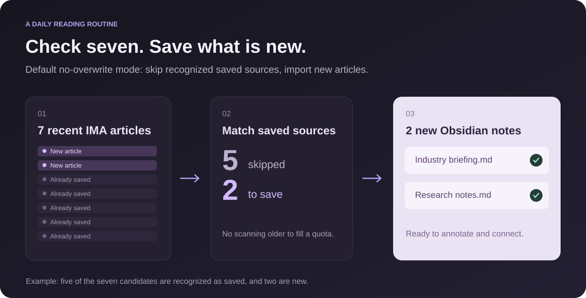
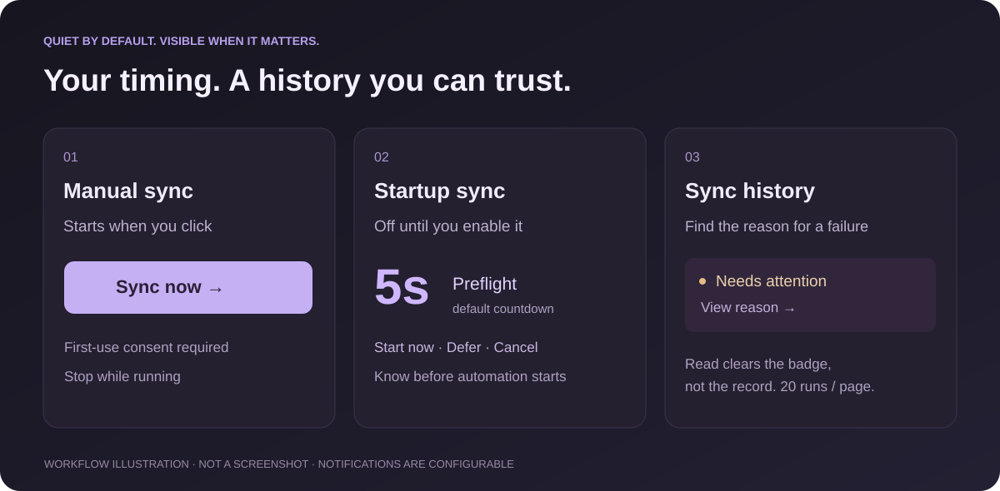

# IMA Share Sync

**English** · [简体中文](https://github.com/oooing/ima-share-sync/blob/main/README.zh-CN.md)


**Less copying. More reading, thinking, and connecting ideas.**

Save text articles shared in IMA to your own Obsidian vault as local Markdown notes.

Windows only · No other Obsidian plugins required · Local Markdown · MIT licensed

[Download 0.1.2](https://github.com/oooing/ima-share-sync/releases/tag/0.1.2) · [Quick start](#quick-start) · [Limitations](#before-you-start) · [Report an issue](https://github.com/oooing/ima-share-sync/issues)

---

## Does this sound familiar?

You follow an IMA shared knowledge base for daily industry briefings, study materials, or team notes. You read in IMA, but keep your own research and conclusions in Obsidian.

Saving an article means repeating the same routine:

**Open → copy → create a note → fix the formatting → check whether you saved it before.**

A few days later, it becomes hard to remember what is saved, what is missing, and which failed attempt needs another try.

**IMA Share Sync handles that repeated transfer.** It reads shared text articles you are allowed to access through your local IMA desktop app and saves them to a folder in your vault. From there, search, annotate, and link them to your own ideas.

> **Example: your daily research reading**
>
> Sync an IMA folder called “Daily Briefings” to `Research/Industry` in Obsidian.
>
> Set the plugin to check the latest **7 articles**. If 5 are recognized as already saved and 2 are new, the default no-overwrite mode skips the saved items and imports the new ones as Markdown.
>
> Tomorrow, sync again and spend your time writing conclusions rather than moving text. If something fails, the sync history explains why.
>
> *7 is the candidate limit, not a quota of 7 new notes. The plugin does not keep scanning older articles to fill that quota.*



## What it takes care of

| What you need | What the plugin does |
| --- | --- |
| Keep shared reading in your own vault | Saves text articles as local Markdown notes |
| Avoid repeated copying | Defaults to no overwrite; skips recognized saved sources |
| Protect your own notes | In general-text mode, treats uncertain same-name sources as conflicts rather than overwriting them |
| Recover a missing note | Can retry a deleted local note if its source is still within the checked range |
| Know when automation will run | Shows a five-second preflight for automatic sync; lets you defer, cancel, or stop |
| See what happened | Keeps a paginated sync history in the sidebar, with 20 runs per page and error details |
| Keep your setup simple | Runs independently, without other Obsidian plugins |

## Quick start

### 1 · Check the requirements

- **Windows 10 or later**, with an interactive desktop session.
- **Obsidian desktop 1.11.4 or later**.
- The **IMA desktop app**, installed and signed in, with access to the source knowledge base and folder.

macOS, Linux, Android, and iOS are not supported. The current extractor targets the verified **Chinese IMA sharing interface**. The plugin interface currently uses Chinese labels; English translations below help you locate the controls.

### 2 · Install the plugin

Download `main.js`, `manifest.json`, and `styles.css` from the [0.1.2 release](https://github.com/oooing/ima-share-sync/releases/tag/0.1.2), then place them here:

```text
Your vault/
└─ .obsidian/
   └─ plugins/
      └─ ima-speed-sync/
         ├─ main.js
         ├─ manifest.json
         └─ styles.css
```

Enable **IMA Share Sync** under **Settings → Community plugins**. Restart Obsidian if the list has not refreshed.

> `ima-speed-sync` is the legacy internal ID, retained for installation compatibility. The display name is **IMA Share Sync**. When upgrading, replace only the three files above. **Keep `data.json`** to preserve settings and sync history.

### 3 · Choose a source and destination

| Setting | Example |
| --- | --- |
| IMA knowledge-base name | My Reading |
| IMA folder name | Daily Briefings |
| Obsidian destination folder | `Research/Industry` |
| Content mode | 通用文字 — General text |
| Recent articles to check | 7 |

Enter the full names exactly as they appear in IMA. The destination is a **relative path within the current vault**.

### 4 · Click 立即同步 — Sync now

Approve the local automation consent on first use. After that, manual sync starts immediately, **without an extra countdown**.

Open **文章 (Articles)** from the sidebar home, then click a title to open its note directly in Obsidian. Open **同步日志 (Sync logs)** for a separate history list with 20 runs per page. Expand an individual record for results and errors; the top-left arrow returns home without deleting records or resetting the page number.

The installed version appears beside the sidebar title and in settings.

## Stay informed, without constant interruptions

**When you click Sync now:** a small bottom-right operation card shows progress and a stop button. The completion message contains only the key results.

**When you enable startup sync:** automatic runs show a five-second preflight by default. Start immediately, defer for five minutes, or cancel. Startup sync is off by default and requires your consent.

**When something goes wrong:** a brief notification links to the reason; full details remain in the sync history. Reading the record clears the unread error badge. A new error can notify you again.

Notifications, error badges, and start/end prompts are configurable. Turning them off does not remove the history, and a stop control remains available during a run.



*Workflow illustration, not an application screenshot. The current plugin UI uses Chinese labels.*

## Before you start

### Text articles, not a complete IMA export

New installations default to general-text mode. Articles do not need a date-based title, a table of contents, an update timestamp, or a minimum length.

- Recognized titles, body text, links, and dividers are preserved as Markdown where possible.
- Inaccessible link targets or unconfirmed content boundaries produce an error instead of being reported as a complete import.
- **PDFs, images, attachments, embedded cards, and complex tables** are not fully exported.
- IMA interface changes can affect extraction.

<details>
<summary>Will upgrading broaden my existing sync scope?</summary>

No. Existing installations keep the legacy “速看” preset and its title and article-structure rules. Switch to “通用文字” (General text) explicitly when you want to sync other text articles.

</details>

<details>
<summary>Does no-overwrite mode check saved articles for updates?</summary>

No. It skips recognized local sources rather than checking for newer revisions. In general-text mode, overwrite still requires a confirmed source match; uncertain matches protect the existing file. The legacy preset retains its filename-based behavior. See the technical documentation for details.

</details>

<details>
<summary>Can I keep using my computer during sync?</summary>

The plugin prefers accessibility operations scoped to the IMA window. It does not use global select-all/copy or the clipboard. However, IMA may bring its own windows forward: this is not a fully headless background service. Avoid interacting with the article being read.

Optional foreground fallback is off by default and must be enabled by you. You can stop a run at any time; cancellation keeps only articles already verified and saved.

</details>

<details>
<summary>Why does the sidebar order differ from Obsidian's file explorer?</summary>

The plugin prefers recognizable dates in titles, newest first, then available source timestamps or local creation times. Obsidian's file explorer has its own sort settings. The plugin does not invent a year for titles or automatically rename old notes.

</details>

## Local content, transparent permissions

The plugin reads text accessible to your signed-in IMA account and creates or updates Markdown in your chosen vault folder. It has **no telemetry, ads, or custom upload service**. IMA itself may need a network connection.

Sync history is stored in the plugin's `data.json`. Technical diagnostics are stored in `%LOCALAPPDATA%\ima-speed-sync\sync.log`. Logs may include article titles; inspect and redact them before sharing. Your vault backup or sync service may also copy these files.

**Desktop automation and access outside the vault:** the plugin runs bundled PowerShell scripts and Windows UI Automation through `child_process`. Temporary scripts, extraction results, and operation-card communication use `%TEMP%\ima-speed-sync\run-*` and `%TEMP%\ima-operation-card-*`. Cleanup is attempted when a run ends, but crashes or cleanup failures can leave temporary files. The IMA installation path under `%LOCALAPPDATA%` may be checked to launch the client. The plugin does not download executable dependencies or update itself.

**Accounts and websites:** install and sign in to IMA yourself. The plugin does not collect your IMA password or send content to its own server. GitHub support and documentation links open in your browser only when clicked.

Only sync content you have permission to copy and save. This is an independent community project, **not an official Tencent, IMA, or Obsidian product**, and does not imply their endorsement.

## Development and contributions

```powershell
npm ci
npm run check
npm run build
```

Build output is in `dist/`. Checks cover version consistency, linting, types, JavaScript behavior, PowerShell extraction, and the native operation card. Automated tests are not a guarantee of compatibility with every IMA version.

- [Technical details and known limitations (Chinese)](docs/TECHNICAL.md)
- [0.1.2 release notes (Chinese)](docs/releases/0.1.2.md)
- [Security and privacy](SECURITY.md)
- [Report an issue or suggest an improvement](https://github.com/oooing/ima-share-sync/issues)

Please include your Windows, Obsidian, and IMA versions, article type, and **redacted** error details. Do not publish private article text, personal data, or credentials.

## License

Code is licensed under the [MIT License](LICENSE). Product names and brand assets belong to their respective owners.

If the plugin saves you a few rounds of copying and pasting, a **Star** on GitHub is appreciated. Real-world feedback is welcome, too.
