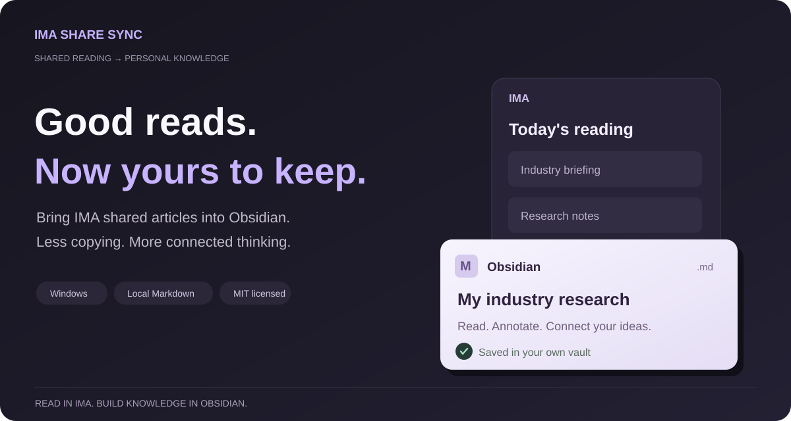

# IMA Share Sync

**English** · [简体中文](https://github.com/oooing/ima-share-sync/blob/main/README.zh-CN.md)

Save IMA shared text articles to Obsidian as local Markdown notes.

Read daily briefings in IMA? Click sync to keep them alongside your own notes, without copying each article by hand.

*The plugin interface currently uses Chinese.*

## Quick start

Requires Windows 10+, Obsidian 1.11.4+, and a signed-in IMA desktop app with access to your source folder. No other plugins needed.

1. Download `main.js`, `manifest.json`, and `styles.css` from the [Latest Release](https://github.com/oooing/ima-share-sync/releases/latest).
2. Place all three files into `<your-vault>/.obsidian/plugins/ima-speed-sync/`.
3. In Obsidian, go to **Community plugins** and enable **IMA Share Sync**.
4. In settings, enter your IMA knowledge base, source folder, and destination folder within your vault. Click **立即同步 (Sync now)** and approve automation on first use.

## Before you sync

- Recognized saved articles are skipped by default. Check results in the sidebar sync logs.
- Local desktop automation may open IMA windows. You can stop it anytime; this is not a headless service.
- For text articles; PDFs, images, and attachments are not fully supported.

No telemetry or custom servers are used (IMA itself still requires internet). Licensed under [MIT](LICENSE); independent project not affiliated with Tencent, IMA, or Obsidian.

[Full guide](docs/GUIDE.md) · [Technical details](docs/TECHNICAL.md) · [Privacy & security](SECURITY.md) · [Feedback](https://github.com/oooing/ima-share-sync/issues)
