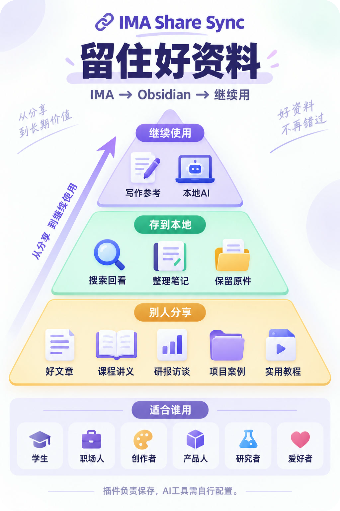

<h1>IMA Share Sync</h1>

<strong>简体中文</strong> · <a href="README.en.md">English</a>

<strong>好资料，值得留下来。</strong>

把别人通过 IMA 分享的文章、教程和文件存进 Obsidian，方便回看、写作参考，也可交给本地 AI 分析。

<a href="https://github.com/oooing/ima-share-sync/blob/main/docs/GUIDE.zh-CN.md">查看指南</a> · <a href="https://github.com/oooing/ima-share-sync/releases/tag/0.2.0">下载文件</a>

Windows 10 及以上 · Obsidian 1.11.4 及以上 · 已安装并登录 IMA 桌面版。

<a href="#适合谁用">适用场景</a> · <a href="#现有功能">全部功能</a>

---

## 适合谁用

[学习备考](#学习备考) · [工作参考](#工作参考) · [内容创作](#内容创作) · [产品调研](#产品调研) · [行业研究](#行业研究) · [兴趣收藏](#兴趣收藏)

一图概览

### 学习备考

**适合谁**：学生、备考者、正在学新技能的人。

**举个例子**：保存别人分享的课程讲义和学习文章，复习时集中查找，再用本地 AI 整理知识要点。

 

### 工作参考

**适合谁**：职场新人、项目负责人、常写方案的人。

**举个例子**：保存同事分享的项目案例和工作指南，下次写方案、做汇报时，快速找到参考。

 

### 内容创作

**适合谁**：自媒体作者、内容编辑、知识分享者。

**举个例子**：保存好文章、人物故事和行业案例，写作时回查出处，也可让本地 AI 整理素材、拟定提纲。

 

### 产品调研

**适合谁**：产品经理、设计师、独立开发者。

**举个例子**：保存同类产品介绍、用户反馈和设计案例，规划下一次更新时，比较功能、价格与做法。

 

### 行业研究

**适合谁**：行业研究者、投研从业者、长期观察者。

**举个例子**：保存别人分享的研报、公司分析和行业访谈，再让本地 AI 比较不同观点，回查原文依据。

 

### 兴趣收藏

**适合谁**：摄影、园艺、烹饪等爱好者。

**举个例子**：保存别人分享的构图教程、养花经验或菜谱，练习时随手翻看，也能加上自己的心得。

*插件负责保存资料；本地 AI 整理与分析需要你自行配置工具。*

---

## 现有功能

### 资料保存

 <strong>文章保存</strong> 
把获准保存的 IMA 文章存成 Obsidian 笔记，可搜索、标注，并与已有笔记一起查看。

 <strong>原件保存</strong> 
通过 IMA 可用的下载入口，保存 PDF、图片和支持的音视频原文件。

 <strong>按需保存</strong> 
检查最近 1–30 份资料，或扩大保存范围；可按标题筛选，批量保存也有数量限制。

 <strong>保留分组</strong> 
可检查子文件夹，设置查找层数与文件夹数量，并按来源文件夹名称存放。

### 笔记整理

 <strong>生成笔记</strong> 
从 PDF 提取已有文字并生成笔记，可附原件链接；扫描版只生成提示笔记。

 <strong>补齐笔记</strong> 
给已保存的 PDF 手动补上缺少的笔记，不用重新下载原文件。

 <strong>重复跳过</strong> 
默认跳过已识别保存过的文章，减少重复保存。

 <strong>保护笔记</strong> 
默认不覆盖同名文件；转换 PDF 时，保护非本插件生成的笔记。

 <strong>导入检查</strong> 
导入前检查 PDF；发现文件损坏或受保护时，会提示原因。

### 进度掌握

 <strong>保存控制</strong> 
可手动开始，或开启启动时自动保存；自动保存前可推迟、取消，执行中可停止。

 <strong>保存记录</strong> 
查看每次保存的文章与结果；出错时，可定位到对应记录。

 <strong>进度提醒</strong> 
查看保存进度，按需设置结果提醒、角标和桌面提示。

 <strong>设置语言</strong> 
设置页可跟随 Obsidian，或选择中文、英文；部分侧栏和运行提示仍为中文。

