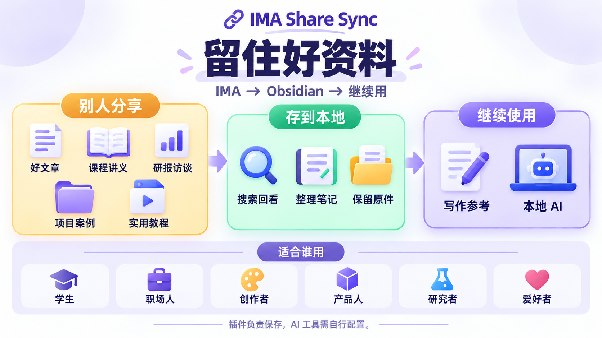
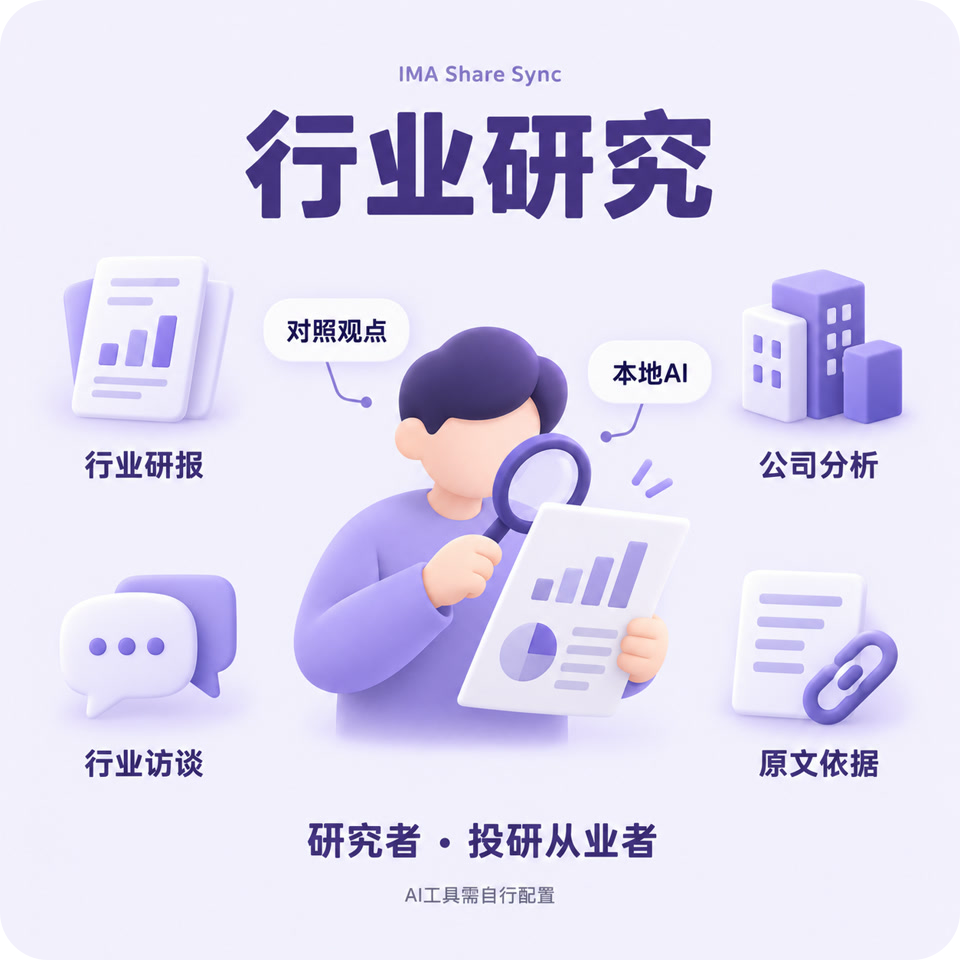
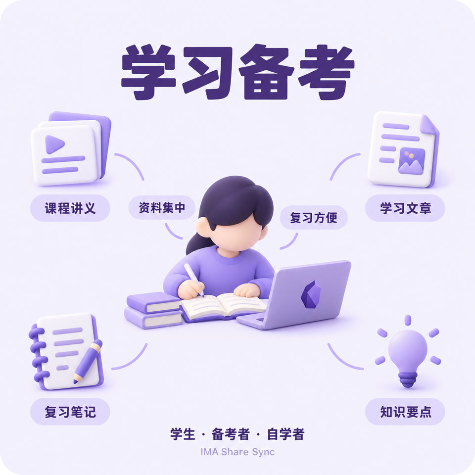
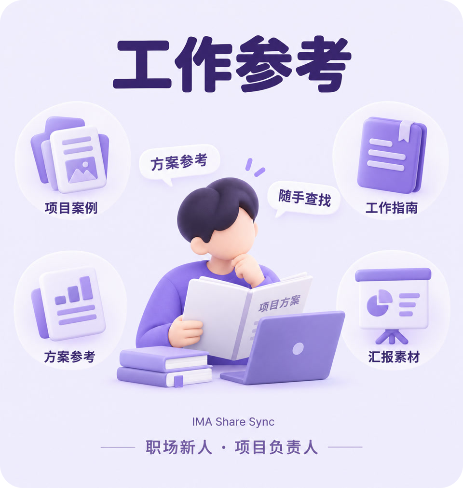
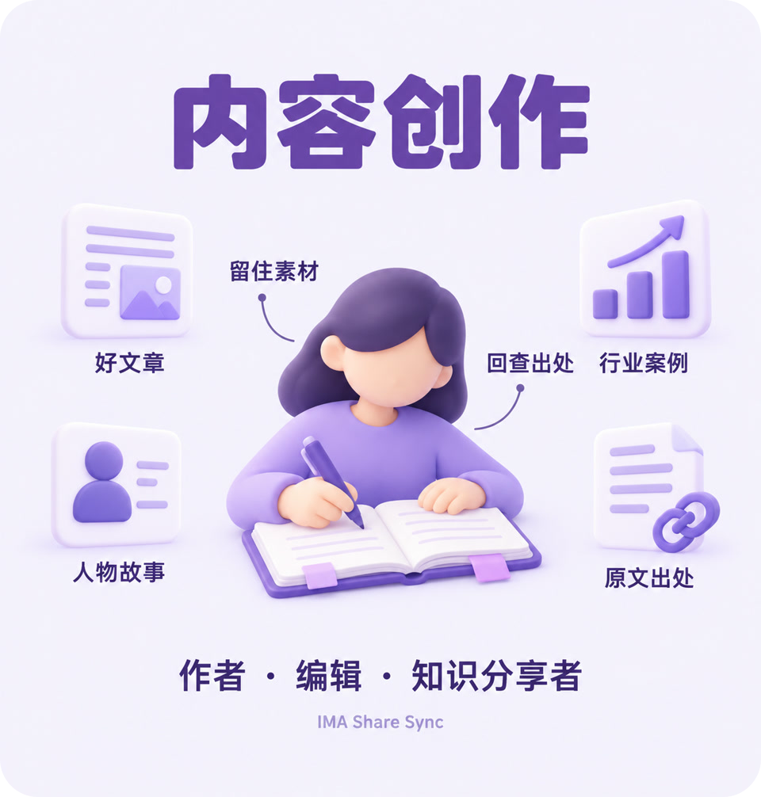
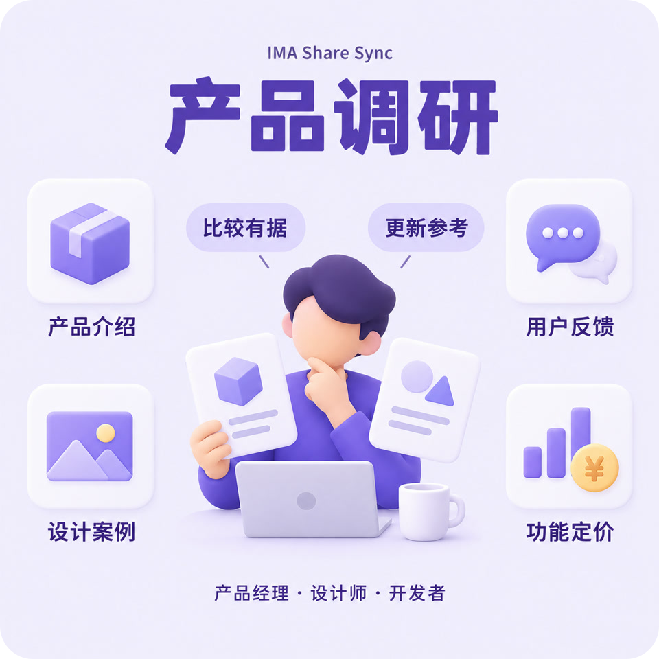
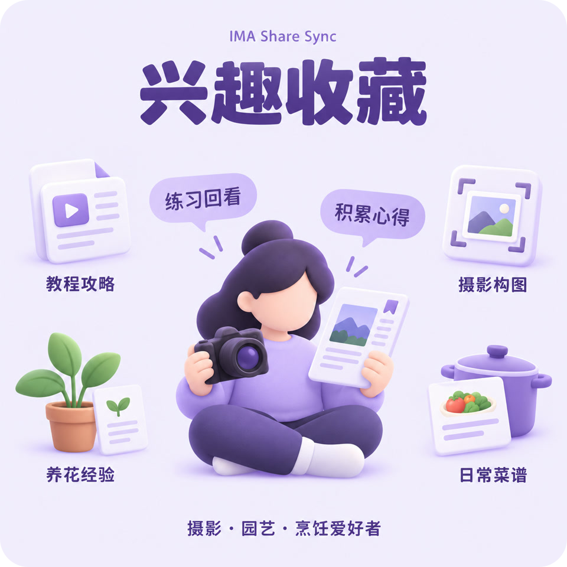

<h1>IMA Share Sync</h1>

<strong>简体中文</strong> · <a href="README.en.md">English</a>

<strong>随时回看</strong>

把别人通过 IMA 分享的文章和文件，存到电脑上的 Obsidian。 想看就查，写作就用。

<a href="https://obsidian.md/plugins?id=ima-speed-sync"><strong>安装插件 →</strong></a>

<a href="https://github.com/oooing/ima-share-sync/blob/main/docs/GUIDE.zh-CN.md">使用指南</a> · <a href="https://github.com/oooing/ima-share-sync/releases/tag/0.2.0">下载文件</a>

Windows 10+ · Obsidian 1.11.4+ · 已安装并登录 IMA 电脑版

<a href="#适合谁用">适合谁用</a> · <a href="#能做什么">能做什么</a>

---

## 适合谁用

学习、工作、写作，把要用的资料留在自己的电脑里。

> 资料由插件保存。AI 整理和分析需另行设置工具。

---

### 行业研究

**适合谁**：研究行业、分析公司、长期跟踪变化的人。

**举个例子**：保存研报、公司分析和访谈，比较不同观点时，随手查回原文。

---

### 学习备考

**适合谁**：学生、备考者、正在学新技能的人。

**举个例子**：把讲义和学习文章放在一起，复习时少翻几个地方。

---

### 工作参考

**适合谁**：刚入职、带项目、常写方案的人。

**举个例子**：保存同事分享的案例和指南，下次写方案、做汇报时直接找来参考。

---

### 内容创作

**适合谁**：写文章、做编辑、分享知识的人。

**举个例子**：留下好文章和人物故事，写作时有素材，引用时找得到出处。

---

### 产品调研

**适合谁**：做产品、做设计、开发软件的人。

**举个例子**：把产品介绍、用户反馈和设计案例放在一起，方便比较功能和价格。

---

### 兴趣收藏

**适合谁**：喜欢摄影、养花、做饭的人。

**举个例子**：存好摄影教程、养花心得和菜谱，练习时边看边做，再记下自己的体会。

---

## 能做什么

展开一组，看看能做什么。

<strong>保存资料</strong> · 4 项

**保存文章**  
把允许保存的 IMA 文章存成笔记，查找、标注时和其他笔记放在一起。

**保存原件**  
从 IMA 提供的下载入口，保存 PDF、图片及支持下载的音视频原件。

**挑选资料**  
可先查看最近 1–30 份资料，也可扩大范围、按标题挑选；每批保存有数量上限。

**保留分组**  
按原来的文件夹名称存放资料；可包含子文件夹，并限制查找层数和文件夹数量。

<strong>整理笔记</strong> · 5 项

**转成笔记**  
把 PDF 中已有的文字转成笔记，可附原件链接；扫描版只生成提示，不识别图片里的字。

**补齐笔记**  
给已存好的 PDF 补上缺少的笔记，不用重新下载。

**跳过重复**  
默认跳过识别为已保存的文章，少存重复内容。

**保护笔记**  
默认不替换同名文件；把 PDF 转成笔记时，会保留其他方式创建的笔记。

**检查文件**  
检查 PDF 是否可用，遇到损坏或限制读取的文件，会提示原因。

<strong>日常使用</strong> · 4 项

**控制保存**  
可手动开始，也可随 Obsidian 启动自动保存；自动开始前可推迟或取消，保存中可停止。

**查看记录**  
查看每次保存了哪些文章、是否成功；遇到问题，找到对应记录再检查。

**查看进度**  
查看保存进度，按需开启结果提醒、图标上的提示或电脑通知。

**切换语言**  
设置页可选中文、英文，或跟随 Obsidian 的语言；部分侧栏和提示仍为中文。

---

### 开始收藏

把下一份好资料，留在自己的电脑里。

**[安装插件 →](https://obsidian.md/plugins?id=ima-speed-sync)** · [使用指南](https://github.com/oooing/ima-share-sync/blob/main/docs/GUIDE.zh-CN.md)
