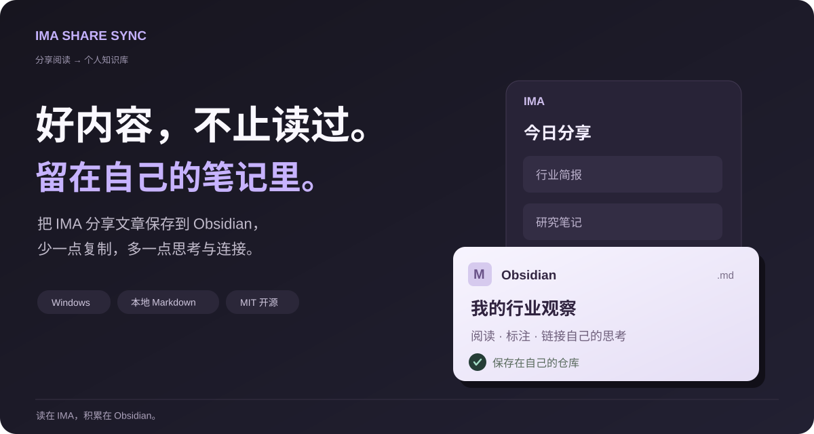

# IMA Share Sync

[English](https://github.com/oooing/ima-share-sync/blob/main/README.md) · **简体中文**

把 IMA 分享的文字文章保存为 Obsidian 本地 Markdown 笔记。

每天在 IMA 读行业简报？点一次同步，就能把文章留在自己的笔记库，继续标注、整理，不用逐篇复制。

## 开始使用

**准备环境**：Windows 10+，Obsidian 1.11.4+，已登录 IMA 桌面端且可打开目标分享文件夹（无需其他插件）。

1. 前往 [最新发布页](https://github.com/oooing/ima-share-sync/releases/latest) 下载 `main.js`、`manifest.json`、`styles.css`。
2. 将这三个文件放入 `<你的笔记库>/.obsidian/plugins/ima-speed-sync/` 目录。
3. 在 Obsidian 的「第三方插件」中启用 **IMA Share Sync**。
4. 在插件设置中填入 IMA 知识库名、来源文件夹和仓库内保存目录，点击「立即同步」（首次需确认本地授权）。

## 同步前了解

- 默认跳过已识别保存的文章，结果和错误可在侧栏日志中查看。
- 通过本地桌面自动化读取，IMA 可能弹窗，可随时停止，并非无感后台。
- 适用于文字文章，暂不完整支持 PDF、图片和附件。

插件无遥测和自建上传服务（IMA 自身仍需联网），基于 [MIT 协议](LICENSE) 开源，非官方项目。

[完整指南](docs/GUIDE.zh-CN.md) · [技术说明](docs/TECHNICAL.md) · [隐私与安全](SECURITY.md) · [反馈建议](https://github.com/oooing/ima-share-sync/issues)
