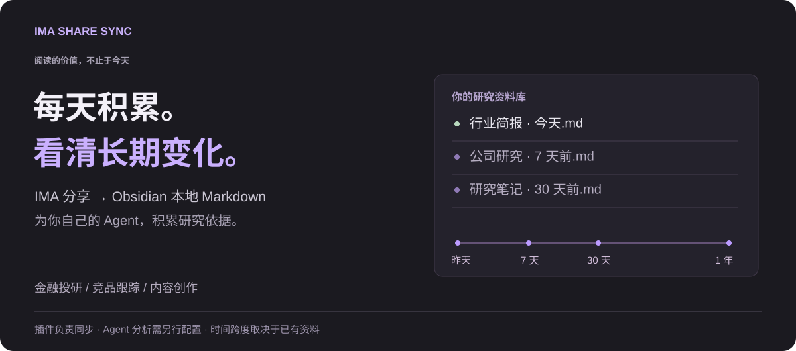

# IMA Share Sync

[English](https://github.com/oooing/ima-share-sync/blob/main/README.md) · **简体中文**

**别人分享的好资料，积累成你的本地研究库。**

将**别人通过 IMA 分享的文字文章**保存为 Obsidian 本地 Markdown，和自己的笔记一起检索、标注，再交给自己的 Agent 分析。不只整理自己的上传，也积累他人的分享。

## 金融投研：跟上今天，也看清趋势

每天把获准保存的投研分享（含获授权的付费内容）积累到本地。再用 Agent 按近 3／7／30 天、半年或一年，对照公司与行业的观点变化，寻找值得验证的线索。

> “近 7 天，人形机器人的订单与量产预期有哪些新变化？请对照此前 30 天，附原文依据。”

## 还可以这样用

**竞品跟踪**：积累产品动态，对照定价、功能与定位的变化。

**内容创作**：平时积累素材，写作时整理案例、不同观点与来源。

[更多用例与提问示例 →](docs/USE-CASES.zh-CN.md)

*插件负责同步；Agent 与自动分析需另行配置。跨期比较取决于已有资料，不提供实时行情或投资建议。*

## 开始使用

Windows 10+ · Obsidian 1.11.4+ · 已登录且可访问分享的 IMA 桌面端 · 无需其他插件。

按[安装指南](docs/GUIDE.zh-CN.md)安装[最新版本](https://github.com/oooing/ima-share-sync/releases/latest)，选择分享来源与保存目录，即可同步；可选开启启动同步。

## 同步前了解

- 默认跳过已识别保存的文章，结果可查日志。
- 桌面自动化可能打开 IMA，可随时停止；PDF、图片和附件暂不完整支持。
- 仅保存获授权的内容，不解锁付费或绕过限制；本地副本不转移版权或转载权限。

无遥测和自建上传服务；IMA 仍需联网，云端 Agent 或笔记同步服务可能上传你授权的内容。

基于 [MIT 协议](LICENSE) 开源，非腾讯、IMA 或 Obsidian 官方项目。

[完整指南](docs/GUIDE.zh-CN.md) · [技术说明](docs/TECHNICAL.md) · [隐私与安全](SECURITY.md) · [反馈建议](https://github.com/oooing/ima-share-sync/issues)
