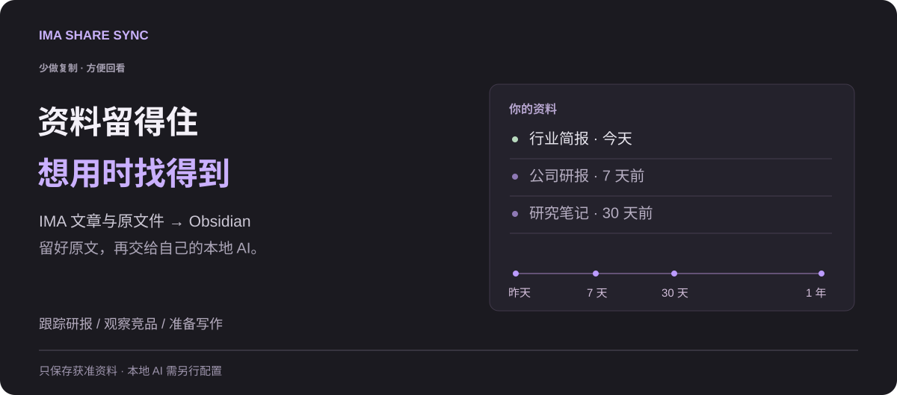

# IMA Share Sync

[English](README.md) · **简体中文**

## 资料留得住

把别人通过 IMA 分享的研报和好文章存进 Obsidian，再交给自己配置的本地 AI 分析。

  

<a href="https://github.com/oooing/ima-share-sync/blob/main/docs/GUIDE.zh-CN.md">查看指南</a> · <a href="https://github.com/oooing/ima-share-sync/releases/tag/0.2.0">下载文件</a>

Windows 10 及以上 · Obsidian 1.11.4 及以上 · 已安装并登录 IMA 桌面版。

## 现在能帮你

- **少做复制**：选好资料来源和保存位置，让插件帮你保存文章，少一点来回复制。
- **方便回看**：文章存成笔记，方便在 Obsidian 中搜索、标注，和已有笔记一起查看。
- **交给AI**：把保存好的资料交给自己配置的本地 AI，比较观点、找变化、查原文依据。

## 这次更新

- **留好原件**：保存 IMA 支持下载的 PDF、图片和部分音视频，方便回看原件。
- **生成笔记**：把 PDF 里的文字变成可搜索的笔记，不用另外安装转换工具。
- **按需保存**：挑最近的资料，也可按标题和文件夹筛选，决定这次保存什么。
- **保留分组**：可检查子文件夹，并按来源文件夹名称存放，回看时更容易分清。
- **补齐笔记**：已保存的 PDF，也能手动补上对应笔记，按设置附上原件链接。
- **导入检查**：导入前检查 PDF，发现文件损坏或受保护时，会提示原因。
- **设置好找**：保存范围、生成笔记、提醒和基础选项分开显示；设置页可选中英文。
- **篇数照旧**：更新后沿用原来的篇数规则；想调整时，再选择每次保存的总篇数。

[发布说明](https://github.com/oooing/ima-share-sync/releases/tag/0.2.0) · [数量规则](docs/general-selection.md)

## 适合这样用

- **跟踪研报**：把不同时间的研报交给自己配置的本地 AI，比较观点和证据的变化。
- **观察竞品**：留住产品更新和价格变化的资料，做比较时不用重新翻找。
- **准备写作**：把文章和案例留作素材，写作时找观点、找例子，也能回头查原文。
- **长期研究**：围绕一个问题慢慢积累，读到新资料时，方便回看旧笔记。

[更多用法](docs/USE-CASES.zh-CN.md)

## 开始保存

1. 通过上方入口安装插件，按指南完成设置。
2. 选好 IMA 中的分享来源，以及 Obsidian 中的保存位置。
3. 开始保存；需要 AI 整理时，再配置能读取这些文件的本地 AI 工具。

## 使用前了解

- **扫描文件**：图片扫描的 PDF 会生成可打开原件的提示笔记，暂不识别图片里的文字。
- **复杂排版**：复杂表格和排版可能与原件不同；需要准确引用时，请回看原文件。
- **保存数量**：批量保存也有文件夹范围和数量限制，不保证一次保存全部资料。
- **保存权限**：只保存你获准复制或下载的资料；原文件需要 IMA 提供可用下载入口。
- **另配工具**：AI 整理需另行配置，插件本身不生成分析结论。
- **界面语言**：设置页可选中英文；部分侧栏和运行提示仍为中文。
- **保存记录**：默认跳过已识别保存的文章；保存结果可在记录中查看。
- **随时停止**：保存过程可能打开 IMA；需要时可以停止。
- **版权不变**：本地保存不代表可以转载；插件不解锁付费内容或绕过限制。

## 隐私说明

插件不收集使用数据，也没有自己的上传服务。IMA 仍需联网；你配置的 AI 或笔记同步服务可能上传获授权的资料。

基于 [MIT 协议](LICENSE) 开源，非腾讯、IMA 或 Obsidian 官方项目。

[完整指南](docs/GUIDE.zh-CN.md) · [技术说明](docs/TECHNICAL.md) · [隐私详情](SECURITY.md) · [反馈建议](https://github.com/oooing/ima-share-sync/issues)
