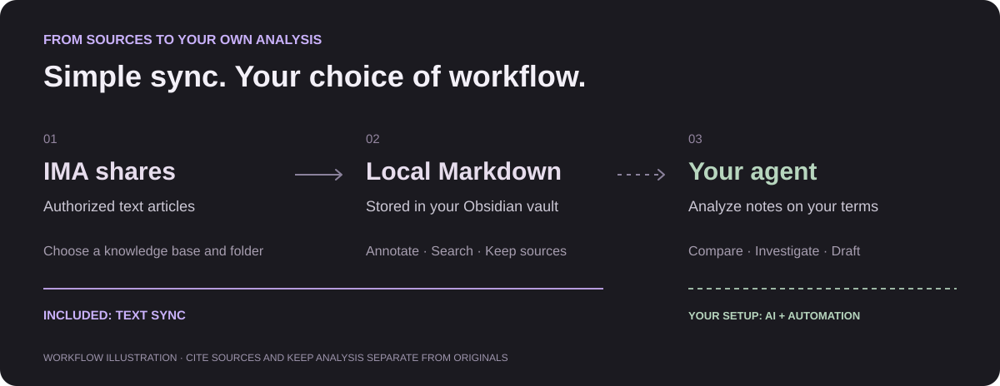
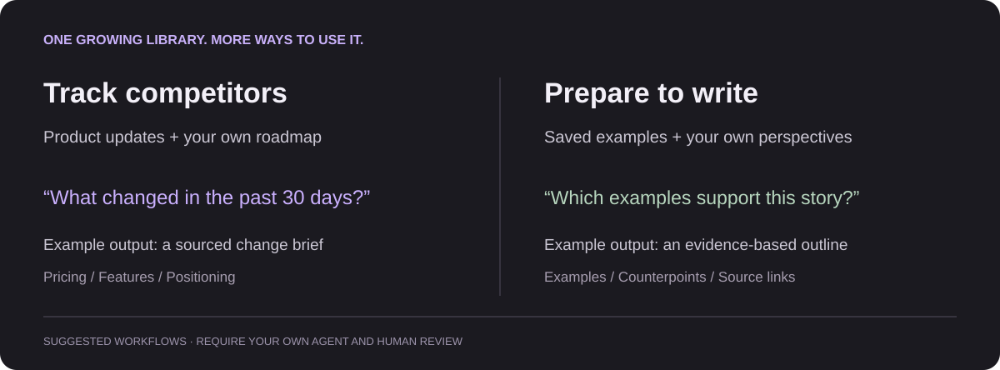

# Put your reading to work

[← Back to the overview](../README.md) · [简体中文](USE-CASES.zh-CN.md)

Start with **text articles other people share with you through IMA**, not just your own uploads. Where you have permission to access and save them, keep local Markdown copies in Obsidian that you can organize, search, and use with an agent that reads local files. These are suggested workflows—not built-in analysis features or customer testimonials.

## 1. Investment research: follow changes and their evidence

For example, you join a research-sharing library that updates daily, possibly through a paid subscription. With the appropriate access and local-saving permissions, turn supported research commentary, company views, and industry briefings into a growing local collection, rather than only browsing them in IMA. With your own agent and sufficient history, compare yesterday, the past 3 / 7 / 30 days, or six months to a year.

A subscription or viewing permission does not automatically permit saving or redistribution. Follow the sharer's permissions; the plugin is not for unlocking paid content or bypassing restrictions, and local copies do not transfer copyright.

> Compare the past 7 days of robotics research with the preceding 30 days. For each company, identify changes in orders, production timelines, and earnings expectations. Separate new evidence, repeated views, and disagreements. Include dates and sources; flag gaps and do not infer buy or sell recommendations.

The intended output: a source-linked change brief for further investigation, not an unsupported investment answer.

## 2. Competitor tracking: relate new moves to your own plans

Collect competitor updates and industry commentary from IMA, alongside the product plans you maintain in Obsidian.

> Compare the past 30 days of competitor material with the preceding 30 days. Summarize changes in pricing, features, and target users. Compare these with our roadmap and list directions worth testing. Cite sources and separate facts from inference.

The intended output: a before-and-after competitor brief that relates to your product.

## 3. Writing: turn saved material into evidence for your ideas

Keep shared articles, examples, and perspectives locally. When you have a topic, draw on what you have already collected.

> For an article about how AI is changing independent software development, find three real examples and two contrasting perspectives in my notes. Build an outline with sources. Mark evidence gaps instead of inventing details.

The intended output: a traceable outline. You still choose the argument, verify the evidence, and write the final piece.

## 4. Topic research: test new material against earlier conclusions

Accumulate text explainers and research notes around a question you keep returning to.

> What does this month's material add to or contradict in my existing conclusions? List supporting and opposing sources by claim, then identify questions that still need investigation.

## 5. User research: compare today's feedback with past findings

If your team shares authorized interview text or feedback summaries in IMA, compare them with past research after syncing. Redact personal information and follow your team's access rules before giving an agent access.

> Compare this month's feedback with the previous quarter. Which problems persist, and which are new? Group by user segment, preserve links to the original quotes, and do not generalize a few comments to all users.

## Set three boundaries first

- **Check coverage.** Ask the agent to confirm the dates and sources available. Publication dates are not sync dates; a full-year comparison requires adequate source history.
- **Keep sources separate.** Write analysis to separate notes, retain verifiable file paths or source links, and avoid rewriting original material.
- **Configure automation separately.** Scheduled analysis, file-change triggers, and AI inference are not included in this plugin. Cloud agents may receive the content you authorize them to read; local storage does not mean an entirely offline workflow.

## Public practices that informed these examples

These are first-person or team accounts, not IMA Share Sync testimonials or independently verified productivity results. The prompts above are our suggested adaptations.

- [Xavier Lee's Claude + Obsidian research workflow](https://www.linkedin.com/pulse/i-am-equity-research-analyst-software-engineer-still-built-xavier-lee-njwrc) (June 21, 2026): connecting company and industry research with model assumptions and their reasoning.
- [Product managers discussing Claude + Obsidian](https://www.reddit.com/r/ClaudeAI/comments/1r2puy0/product_managers_using_claude_obsidian_what_does/) (February 12, 2026): product context and, in a reply, an agent that relates competitor material to ongoing projects. Anonymous community accounts.
- [Eleanor Konik's reading-to-writing workflow](https://www.eleanorkonik.com/p/the-konik-method-for-organizing-electronic) (October 1, 2025): AI-assisted note organization with human checks of quotations and source links. The author discloses employment at Readwise.
- [An Obsidian community research-to-publication workflow](https://forum.obsidian.md/t/some-rough-notes-on-end-to-end-process-for-recent-academic-publication/11964) (January 25, 2021): connecting themes, arguments, and sources through linked notes.
- [Simple Thread's UX research repository](https://www.simplethread.com/building-a-ux-research-brain-atomic-research-zettelkasten-and-obsidian/) (April 6, 2026): linking questions, facts, and recommendations. The team describes an early-stage practice and explicitly hypothetical client examples.

[Installation and sync guide →](GUIDE.md)
