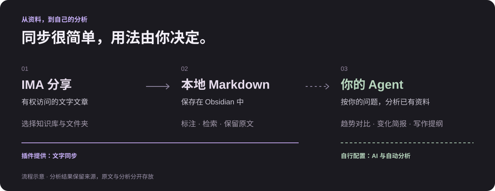
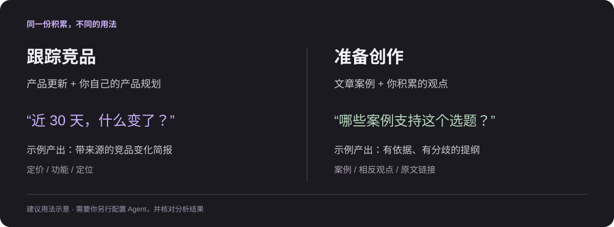

# 让资料持续发挥作用

[← 返回首页](../README.zh-CN.md) · [English](USE-CASES.md)

从**别人通过 IMA 分享给你的文字文章**开始，而不只是自己上传的内容。将有权访问和保存的分享资料同步到本地 Obsidian，保留可由自己整理、检索的 Markdown 副本，再连接能读取本地文件的 Agent。以下是建议用法，不是插件内置的分析功能，也不是客户证言。

## 1. 金融投研：发现变化，也保留判断依据

例如，你加入了每天更新的投研分享库，其中可能有付费订阅内容。在获得相应访问与本地保存许可后，把支持的投行研报文字、行业简报与公司观点从“在 IMA 中浏览”变成持续积累的本地资料。让自己的 Agent 在已有资料范围内，比较昨天、近 3／7／30 天、半年或一年，追踪观点和证据的演变。

订阅或浏览权限不自动等于保存、转载权限。请按分享者的授权范围使用；插件不用于解锁付费内容或绕过限制，保留本地副本也不改变版权归属。

> 对比近 7 天与此前 30 天的人形机器人资料。按公司列出订单、量产进度和盈利预期变化，区分新证据、重复观点与机构分歧。每项附日期和来源；资料不足就注明，不推断买卖结论。

想得到的结果：一份带来源的变化清单，供自己进一步研究，而不是一个没有依据的“投资答案”。

## 2. 竞品跟踪：把新动态放回产品背景中

积累 IMA 中的竞品更新与行业解读，再结合自己在 Obsidian 中维护的产品规划。

> 对比近 30 天与此前 30 天的竞品资料。整理定价、功能和目标用户的变化，对照我们的产品规划，列出值得验证的方向。附来源，区分事实和推测。

想得到的结果：一份有前后对照、与自己产品相关的竞品变化简报。

## 3. 内容创作：从收藏素材，到有依据的表达

将共享文章、案例与观点长期留在本地。准备选题时，先从自己的积累中找素材和不同声音。

> 围绕“AI 如何改变独立开发者”，从我的资料中找三个实际案例和两种相反观点，整理成文章提纲。每个案例附出处，缺少证据的地方标出来，不要补编。

想得到的结果：一份可核对来源的写作提纲；观点、取舍与最终表达仍由自己完成。

## 4. 专题研究：新资料补充了什么，又挑战了什么

围绕一个长期问题，积累文字解读和研究笔记。让新资料与旧结论对话，而不是每次从头开始。

> 本月新增资料对已有结论有哪些补充、矛盾和未解决的问题？按观点列出支持与反对的来源，整理下一步需要查证的问题。

## 5. 用户研究：这次反馈，也能与过去对照

如果团队在 IMA 分享有权处理的访谈文字或反馈总结，可同步后与历史研究对照。涉及个人信息时，先按团队规则脱敏并控制 Agent 的访问范围。

> 对比本月与上季度的反馈：哪些问题持续存在，哪些是新出现的？按用户群体整理，保留原话出处，不将少数反馈推断成所有用户的结论。

## 用之前，约定好三件事

- **分析范围**：先让 Agent 确认资料覆盖的日期与来源。文章日期不等于同步日期，没有一年的资料就不能做完整的年度比较。
- **原文与分析分开**：原文作为依据，分析写入单独的笔记；要求保留可核对的文件路径或来源链接，不直接改写原文。
- **自动化另行配置**：定时分析、文件变化触发与 AI 推理不是插件自带功能。云端 Agent 可能收到你授权读取的内容，本地保存不等于全程离线。

## 这些用例参考了哪些公开实践？

以下是本人或团队公开自述，不是 IMA Share Sync 用户评价，也不是独立验证的效率数据。上面的具体问题是我们据此设计的用法示例。

- [Xavier Lee：Claude + Obsidian 投研实践](https://www.linkedin.com/pulse/i-am-equity-research-analyst-software-engineer-still-built-xavier-lee-njwrc)（2026-06-21）：关联公司、行业资料和模型假设，回查判断依据。
- [产品经理的 Claude + Obsidian 工作流讨论](https://www.reddit.com/r/ClaudeAI/comments/1r2puy0/product_managers_using_claude_obsidian_what_does/)（2026-02-12）：保存产品背景；同帖用户分享将竞品内容与自己的项目交叉分析。匿名社区自述。
- [Eleanor Konik：从阅读笔记到创作](https://www.eleanorkonik.com/p/the-konik-method-for-organizing-electronic)（2025-10-01）：用 AI 整理笔记并人工核对原文、引用链接。作者披露受雇于 Readwise。
- [Obsidian 社区：从研究资料到论文写作](https://forum.obsidian.md/t/some-rough-notes-on-end-to-end-process-for-recent-academic-publication/11964)（2021-01-25）：通过关联笔记组织主题、观点和来源。
- [Simple Thread：建设用户研究资料库](https://www.simplethread.com/building-a-ux-research-brain-atomic-research-zettelkasten-and-obsidian/)（2026-04-06）：关联问题、事实与建议。团队说明仍处于早期实践，文中的具体客户场景为假设示例。

[安装与同步指南 →](GUIDE.zh-CN.md)
